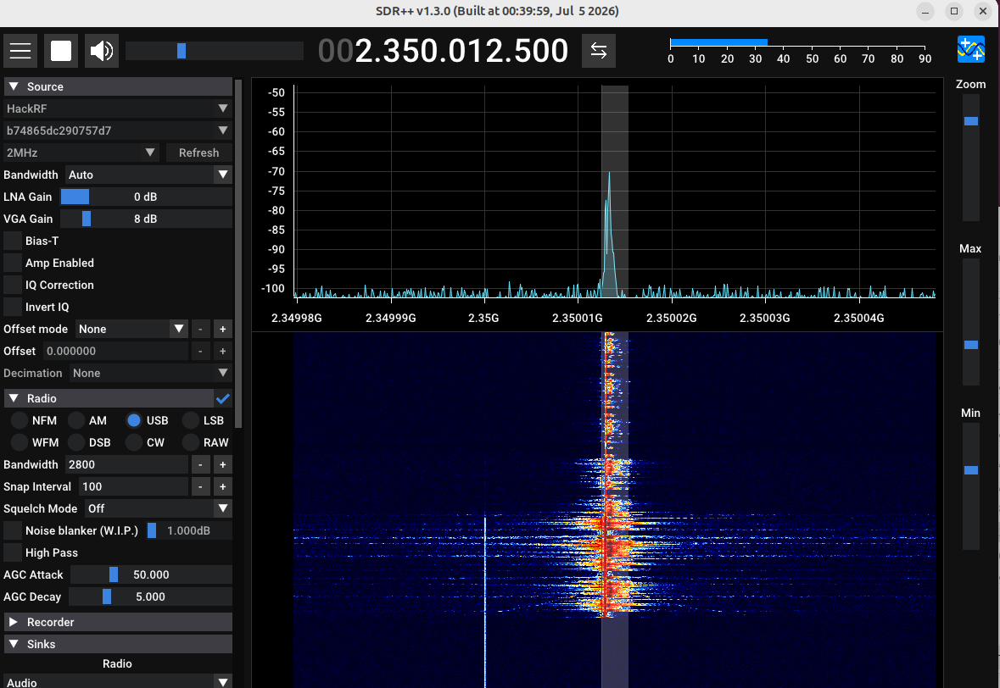

# esp32-sdr-trx: a software-defined transceiver from one ESP32-S3 board



*SDR++ with a HackRF, USB demodulator, tuned to an ESP32-S3 that transmits single-sideband voice on 13 cm. The ESP32-S3 is the only
transmitter.*

Every ESP32-S3 has a 2.4 GHz Wi-Fi radio, and somewhere inside it is an I/Q stream and a test-tone generator that Espressif does not
document. This project uses both, on a plain dev board with a USB cable and no FPGA:

* **Receive** (`espdr-rx`): 1.84 to 2.79 GHz, 250 or 333 ksps of 8-bit I/Q. The chip decimates its 16 Msps ADC stream itself; a bridge makes it an
  `rtl_tcp` server, so **SDR++**, GNU Radio and anything else that speaks `rtl_tcp` can use it.
* **Transmit** (`espdr-tx`): narrowband **FM** and **SSB (USB/LSB)** voice and **RTTY** in the 13 cm amateur band (2320 to 2450 MHz), from a WAV file, a pipe,
  a sound card or a text, with a cancellation of the carrier's thermal drift once the board has a model file (`--thermal`, using the chip's temperature sensor). It is an *experiment* that works: the chip's carrier is steered in frequency and amplitude by software (polar modulation),
  which needs no sample buffers and can run for as long as you like. The chip also has a raw I/Q playback engine (samples from SRAM at up to 80 Msps, found by
  h0m3us3r and reproduced here, see [the research notes](docs/research/TX-RESEARCH.md#stage-6-raw-iq-transmit-confirmed-by-h0m3us3r-reported-not-yet-reproduced-here)); this transmitter does not use it yet. Transmitting takes an amateur radio licence; read [the transmitter guide](docs/transmitter.md) first.

| | Receiver | Transmitter |
|---|---|---|
| Command | `espdr-rx` | `espdr-tx` |
| Range | 1.84 to 2.79 GHz | 2.32 to 2.45 GHz |
| Bandwidth | 250 ksps (±100 kHz) or 333 ksps (±133 kHz) | voice, 300 to 3000 Hz; RTTY 170 Hz shift |
| Modes | rtl_tcp server | FM (±2.5 kHz), USB, LSB, RTTY |
| Sources | the Wi-Fi front end | WAV file, `-` (pipe), sound card; RTTY: text or text file |
| Status | stable, one board tested | experimental, one board tested |

## Install

You need an ESP32-S3 board **with two USB ports** (the second one is a USB-UART bridge that lets the tools load the firmware without buttons), a USB
cable for each, Linux, and Python 3.10 or newer. Download the wheel `esp32_sdr_trx-X.Y.Z-py3-none-any.whl` and `install-linux.sh` from the
[releases page](https://github.com/jochenhammes/esp32-sdr-trx/releases), then:

```sh
chmod +x install-linux.sh                      # downloads have no execute right yet
./install-linux.sh esp32_sdr_trx-X.Y.Z-py3-none-any.whl --audio     # --audio: a sound card as the transmit source
```

That creates a virtual environment of its own, links `espdr-rx` and `espdr-tx` into `~/.local/bin` and offers the udev rule. The package carries the firmware
images; there is nothing to build. **[docs/install.md](docs/install.md)** explains every step, the manual way with `python3 -m venv`, `pipx`, the udev
rule, execute rights and how to remove it.

## Use

```sh
espdr-rx                                      # loads the receiver firmware if needed, starts the rtl_tcp server on 127.0.0.1:1234
                                              # in SDR++: source RTL-TCP, host 127.0.0.1, port 1234, play

espdr-tx --accept-licence -f 2350 -i speech.wav                  # FM voice from a WAV file (the first time only: --accept-licence)
espdr-tx -f 2350 -m usb -i soundcard --power -6                  # SSB from the sound card, 6 dB below the strongest setting
arecord -f S16_LE -r 16000 -c 1 | espdr-tx -f 2350 -m usb -i - --rate 16000   # raw samples from a pipe
espdr-tx -f 2350 -m rtty --text "RYRY CQ CQ DE <your call sign> K"            # RTTY, 45.45 baud, 170 Hz shift (the tones of pluto-tx)
```

Both tools load the right firmware into the board's RAM by themselves and switch it when needed (a few seconds); nothing is written to the
flash unless you ask (`espdr-rx --flash`). `-h` explains every option and shows examples; the full reference is in
[docs/espdr-rx.md](docs/espdr-rx.md) and [docs/espdr-tx.md](docs/espdr-tx.md).

## Temperature correction for the transmitter (`--thermal`)

**Why.** The transmitter warms up while it sends: the chip's temperature sensor climbs from about 42 C (or 20 C after a long rest) to 57 C within a few minutes. The board's 40 MHz crystal changes its frequency with that, and
the carrier at 2.35 GHz moves with it. Measured against a PlutoSDR it ran away by **+230 Hz in 15 s, +800 Hz in 45 s and +2000 Hz in 120 to 150 s** on one board and by **+2700 Hz in 45 s and +4400 Hz in 120 s** on the other, by 20 to 200 Hz
per second. That is too much for **RTTY** (a 170 Hz shift tolerates about 85 Hz, and a receiver's automatic tuning has to chase the signal) and for **SSB**, where the voice is only right if you are tuned to the carrier.

**How it works.** The chip has an on-chip temperature sensor, which the firmware reads between transmissions (`TX_OP_TEMP`). The host predicts the frequency error from the temperature at the start and the
time since the start, with a small model of the crystal (a curve around its turning point, the chip heating towards 58 C, plus a fast rise at the switch-on that the sensor does not show), and adds the opposite to
the frequency field of every record. It works for FM, SSB and RTTY alike, needs no change on the receiving side, and costs nothing in the chip's 25 microsecond loop.

**Tested on two boards, and the numbers belong to the board.** The two boards have the same crystal error and the same heating, but crystals with different turning points (47 C and 41 C) and a very different fast rise at the switch-on, so each board needs
its own model; the first board's model helps the second one little. With its own model the change of the frequency over a transmission fell on board 1 from +700 to +2050 Hz to **+27 to +66 Hz** (45 and 120 s; +396 Hz at the worst) and on board 2
from +2700 to +4400 Hz to **+107 to -323 Hz**; from a cold start (20 to 23 C) the excursion shrank from 4.6 kHz to 1.2 kHz on board 2. What remains: the first seconds after a cold start, and the dependence on how long the board rested before.
Two boards are a small sample; the measurements are in [the transmitter guide, "Thermal drift"](docs/transmitter.md#thermal-drift---thermal) and on the research branch.

**How to use it.** `--thermal auto` is the default: the correction runs if the board has a model file and is off otherwise, so a board without a model is never changed.

```sh
espdr-tx -f 2350 -m usb  -i speech.wav --ppm 5.4                       # auto: uses ~/.config/espdr/thermal-<bridge serial>.json if it exists
espdr-tx -f 2350 -m rtty --text "RYRY CQ CQ DE <your call sign> K" -v   # -v says which model file it looked for
espdr-tx -f 2350 -m rtty --text-file message.txt --thermal nominal      # no sensor reading: assumes the idle temperature
espdr-tx -f 2350 -m usb  -i speech.wav --thermal off                    # never
espdr-tx -f 2350 -m usb  -i speech.wav --thermal-model my-board.json    # a model file of your own
```

To get a model for your board, run `scripts/drift/ab_series.py`, `ab_analyse.py` and `fit_thermal.py` (about 40 minutes of transmitting at 2350 MHz and a PlutoSDR as the receiver; include a cold start), and save the result as
`~/.config/espdr/thermal-<serial number of the board's USB-UART bridge>.json`. The models of the two tested boards are in `scripts/drift/models/` as examples. Set `--ppm` again when you switch the correction on.

## Documentation

| | |
|---|---|
| [Installation](docs/install.md) | step by step: venv, execute rights, `pipx`, the udev rule, removal |
| [Receiver guide](docs/receiver.md) | requirements, first run, SDR++, GNU Radio, gain, frequency accuracy, limits, troubleshooting |
| [Transmitter guide](docs/transmitter.md) | **licence and safety**, modes, power, tuning your receiver, sources, measured performance, limits |
| [espdr-rx](docs/espdr-rx.md), [espdr-tx](docs/espdr-tx.md) | command line reference (also `-h`) |
| [How it works](docs/internals.md) | the time budget, the decimator, the USB stream, the transmit protocol and polar modulation |
| [Research notes](docs/research/TX-RESEARCH.md) | how the transmitter was found out, with every measurement |
| [Research branch `research/iq-tx`](https://github.com/jochenhammes/esp32-sdr-trx/tree/research/iq-tx) | the raw I/Q transmit experiments (SRAM playback engine), with all test results and the research firmware; not part of the releases |
| [Releasing](docs/releasing.md) | for maintainers |

## Research branch: raw I/Q transmit

The branch [`research/iq-tx`](https://github.com/jochenhammes/esp32-sdr-trx/tree/research/iq-tx) holds the experiments with the chip's I/Q playback engine (samples from SRAM to the transmit DAC at up to 80 Msps, found by h0m3us3r).
**All test results are kept there**, not in this branch: the reproduction of the engine on two receivers, the transmit filter and image correction, level, intermodulation, the seam
between buffers, phase noise, the streaming experiments that failed, and the resulting design. Start with
[`docs/research/README.md`](https://github.com/jochenhammes/esp32-sdr-trx/tree/research/iq-tx/docs/research/README.md) on that branch. It also contains a research-only firmware (`make -C firmware TX=1 IQTEST=1`) and a measurement script;
neither is part of the releases, and the transmitter in this branch does not use the engine.

## Honest limits

* Tested on **one** board (a generic ESP32-S3-WROOM-1 dev board with two USB-C ports), one Linux host, a PlutoSDR and a HackRF as test equipment.
  Windows and macOS are untested. Reports from other boards are welcome (issue template *Board / hardware report*).
* The transmitter's power is **not calibrated** (an estimate: some microwatts at the antenna of a dev board), its harmonics and spurious
  emissions are **not measured**, and its frequency is only as good as the board's crystal (up to ±24 kHz; correct it with `--ppm`).
* Receiving: no calibrated levels, a spur at 2400.000 and 2440.000 MHz (the crystal's 60th and 61st harmonic), Wi-Fi-class sensitivity.

## Credits and licence

Built on [eSpDR](https://github.com/h0m3us3r/eSpDR) by h0m3us3r, who found how to read the ESP32-S3's undocumented radio dump path and wrote the
firmware around it; see [NOTICE](NOTICE). This project's additions (the on-chip decimator, USB stream, flash boot, the `rtl_tcp` bridge, the
transmitter, the tools and the documentation) were developed by Jochen Hammes with Claude (Anthropic) as the coding assistant. Every number in the
documentation was measured. Zero-Clause BSD licence ([LICENSE](LICENSE)). Not affiliated with or endorsed by Espressif.
