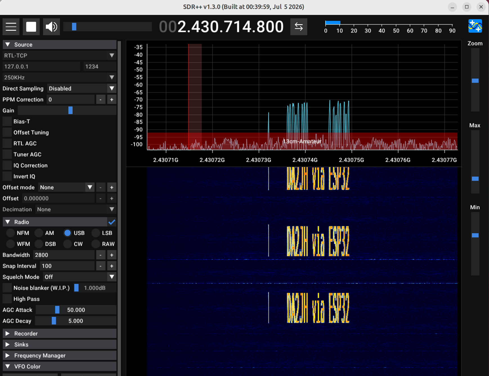

# The receiver: an ESP32-S3 SDR with no FPGA

A 250 or 333 ksps, 2.4 GHz software-defined receiver that needs **one ESP32-S3 board and a USB cable**. The ESP32-S3 samples the I/Q output of its
own Wi-Fi receiver at 16 Msps, decimates it on the chip, and streams the result over USB. `espdr-rx` makes it look like an `rtl_tcp` server, so
**SDR++** and other programs can use it as a receiver.

```
ESP32-S3 ADC  --16 Msps-->  CIC /16  -->  FIR /4 or /3  -->  250 or 333 ksps int8 I/Q  --USB-->  espdr-rx  -->  rtl_tcp  -->  SDR++ / GNU Radio
              (both cores alternate between capture units; the FIR runs on the S3's SIMD unit)
```



*SDR++ receiving a PlutoSDR transmission at 2.4307 GHz through the ESP32-S3 and the `rtl_tcp` bridge. The test transmitter draws text into the waterfall.*

The full 80 MHz span of the original eSpDR needs an FPGA to carry the data out. For a few hundred kHz it does not: 250 ksps of 8-bit samples is
0.5 MB/s (333 ksps: 0.67 MB/s), which USB Full-Speed carries.

| | |
|---|---|
| Frequency range | 1.84 to 2.79 GHz (the Wi-Fi receiver's tuning range, including eSpDR's 5/6 conversion mode below 2.21 GHz) |
| Sample rate | 250 ksps complex, about ±100 kHz usable (flat to 0.04 dB; aliases at least 70 dB down); or 333.3 ksps with `--decim 3`, about ±133 kHz (flat to 0.02 dB, aliases at least 65 dB down) |
| Sample format | int8 I/Q: 0.5 MB/s at 250 ksps, 0.67 MB/s at 333 ksps |
| Retuning | about 50 ms of silence |

**What you do not get**: a wide span (use the FPGA design of eSpDR for that), a calibrated absolute level, an AGC, or a tested guarantee on boards
other than the one below. The 2.4 GHz front end is a Wi-Fi receiver, so expect Wi-Fi-class sensitivity and a strong spur at exactly 2400.000
and 2440.000 MHz (see [Known limitations](#known-limitations)).

Tested on: a generic *ESP32-S3-WROOM-1 development board with two USB-C ports* (a CH343 USB-UART bridge plus the native USB port; chip revision v0.2,
8 MB PSRAM) connected to an x86-64 Ubuntu host, with a PlutoSDR+ as the test transmitter. Other boards and hosts are untested; please
[tell us](https://github.com/jochenhammes/esp32-sdr-trx/issues/new?template=hardware_report.md) what you tried.

## Requirements

* An ESP32-S3 board with **two USB ports** (UART bridge + native USB). This is what lets the tools reset the chip into its loader without buttons.
  A board with only the native port should work too (`--native`, with BOOT held and RESET tapped by hand each time), but that has not been tried.
* Linux (tested). The tools use `pyserial` and `esptool` and should run elsewhere, but nothing else has been tried.
* Python 3.10 or newer, `pipx` or `pip` ([README](../README.md#install)).
* Optional: an antenna (the board's PCB antenna is enough for strong nearby signals), SDR++ or GNU Radio.

On Linux install the udev rule once. It keeps ModemManager from probing the board's port (any byte it sends would stop a run) and lets you use the
board without joining the `dialout` group:

```sh
sudo cp udev/70-espdr.rules /etc/udev/rules.d/ && sudo udevadm control --reload && sudo udevadm trigger
```

## First run

```sh
espdr-rx
```

With both USB cables connected, the tool finds the board, checks what runs on it, loads the receiver firmware into the chip's RAM when it is
not running (about 8 seconds), and starts the `rtl_tcp` server on `127.0.0.1:1234`. The firmware lives in RAM and is gone at power-off; the tool loads it
again whenever it is missing. Add `--flash` once to make the board start the receiver by itself at power-up instead (it **overwrites the board's
flash**; to return to RAM-only use run `python -m esptool erase-flash`; how this works and its limits are in [firmware/flash/README.md](../firmware/flash/README.md)).
Options: `--decim 3` for 333 ksps, `--ppm` for the crystal, `--listen 0.0.0.0:1234` for other computers; see [espdr-rx.md](espdr-rx.md).

To record a few seconds to a file, without the bridge: `python -m espdr.nb run --freq 2412e6 --seconds 5 -o test.cs8`; `python -m espdr.nb -h` lists every
option. `python -m espdr.nb bench --seconds 3` tests the USB link (about 0.87 MB/s and `0 bad blocks` is fine; narrowband mode needs 0.5 to 0.67).

## Using it with other programs

### SDR++ (and anything that speaks rtl_tcp)

In SDR++ choose the source **RTL-TCP**, host `127.0.0.1`, port `1234`, and press play. Tune between 1842 and 2790 MHz. Any sample rate SDR++ offers
works: the bridge interpolates the radio's stream to the rate the client asks for (the radio's own rate is passed through unchanged). The signal is
still only about 200 kHz (`--decim 3`: 270 kHz) wide, whatever rate is shown.

What the bridge does: the radio runs only while a client is connected; a frequency, gain or ppm change stops the run, reconfigures the radio and starts
it again (about 50 ms of silence); the spectrum is conjugated, because the radio delivers *LO minus RF*, so that a higher RF is a higher frequency; the DC
offset is removed; the client's gain (0 to 49.6 dB) is mapped to the ESP's gain selector 30 to 80 (`--gain-min`, `--gain-max`); frequencies outside
the range are clamped, and a frequency the PLL does not lock at is refused with a message, after which the bridge stays on the last frequency that worked.
pluto-advanced-rx and other programs that let you choose an RTL-SDR with a `host:port` connection work the same way.

### GNU Radio

```sh
python -m espdr.nb run --freq 2412e6 --convert cf32 --tcp 7373
```

serves complex float samples on a TCP port for a GNU Radio *TCP Source* (complex, little endian).

### Files

`--format cs8` (default) writes interleaved int8 I, Q; `cs16` int16. Raw files keep the radio's convention, *LO minus RF*: a signal above the LO
appears at a negative frequency. `--convert cf32` conjugates it to the usual convention (`--native-iq` turns that off).

## Gain and level

The `--gain` selector (0 to 127) is a table index, not dB: roughly 1 dB per step from 35 to 76, and values above 83 repeat the
low end. The default 60 puts the noise at about 20 counts of the int8 samples; 24 leaves only about 2 counts, which is mostly
quantization noise. If strong signals clip (`max |I|` near 127), lower the gain or raise `--shift` (default 4).

With a CW carrier at 2400.05 MHz from a PlutoSDR, the received tone stepped 50.8, 39.8 and 29.7 dB above the noise for
TX attenuations of 30, 40 and 50 dB: linear over at least 20 dB. There is no absolute calibration.

## Frequency accuracy

The 40 MHz crystal of a typical board is within ±10 ppm, which is ±24 kHz at 2.4 GHz. Measure yours against a known
carrier and correct it with `--ppm`, positive if the ESP runs fast:

```sh
espdr-rx --ppm 5.5
```

Against a PlutoSDR+ carrier at 2400.050 MHz, `--ppm 5.5` moved the tone from +36 797 Hz to +49 979 Hz. That includes the
Pluto's own error, so calibrate against a source you trust. The bridge also removes the sub-step rounding of the ESP's
synthesizer (up to ±190 Hz) digitally.

## Measured performance

| | |
|---|---|
| USB throughput (bench, one xHCI host) | 0.87 MB/s sustained (13.6 packets of 64 bytes per ms), 0 bad blocks; the chip waits 95 % of the time for the host |
| Narrowband stream | 0.50 MB/s at cs8 and 250 ksps; 0.67 MB/s at 333 ksps |
| Signal processing per capture unit | 285 000 of 480 000 CPU cycles (59 %) at 250 ksps, 295 000 (61 %) at 333 ksps in the on-chip test; worst unit in live runs 62 % and 65 % |
| 120 s runs, 250 ksps (and 3 × 30 s at 333 ksps: 10.0005 M samples each) | 30 000 3xx samples (the end of a unit), none lost; one unit join a few pairs off per run is counted and accepted |
| 2 min through the bridge at 2.4 MS/s | no dropped blocks |
| Retune | about 50 ms |
| Filter (host test, bit-exact against an integer model) | passband flat to 0.04 dB; aliases at least 71 dB down |

## Known limitations

* **250 or 333 ksps, not 500.** The 500 ksps mode (`--decim 2`) needs 1.0 MB/s, but the USB Serial/JTAG port delivers at most 0.87 MB/s
  to this host (the chip is waiting for the host 95 % of the time, one 64-byte packet at a time); with `--decim 2` about a quarter of
  the samples are lost and the chip reports `USB too slow`. The signal processing is no longer the limit (69 % of the time budget).
  Reading the stream with libusb instead of the kernel's serial driver gives the same 0.87 MB/s, so the limit is the USB Full-Speed link
  of the ESP32-S3, not the host software ([internals](internals.md)). A different host controller or a hub was not tried.
* **A strong spur at 2400.000 and 2440.000 MHz.** The 60th and 61st harmonics of the 40 MHz crystal are inside the
  receive band; with the LO at 2400 MHz a line sits at the centre, about 10 dB stronger than a −40 dBm carrier at gain 60. Do not
  mistake it for a signal. Faint lines at about ±1.6 kHz and ±9 kHz around strong signals were also seen; their origin is not
  investigated.
* **Sensitivity falls off away from 2.4 GHz.** The board's antenna and matching are made for Wi-Fi. At 1.9 GHz, which works through
  eSpDR's 5/6 conversion mode, a test carrier needed about 40 dB more power than at 2.4 GHz for the same signal-to-noise ratio.
* **The edges of the tuning range depend on the board.** The PLL has to lock at each request. On the test board it did not lock below
  1848 MHz or between about 2210 and 2219 MHz (the switch between the two conversion modes); every other frequency up to 2790 MHz worked.
  The tools report such a request (`status 6`), and the bridge then stays on the last frequency that worked and says so.
* **The receiver image never transmits.** The transmitter is a separate image ([transmitter guide](transmitter.md)); the tools switch between them.
* **One board tested.** Please report others, with `lsusb` and the output of `bench`.
* **Image rejection** (I/Q balance of the Wi-Fi front end) is not measured.

## Troubleshooting

| Symptom | Cause and fix |
|---|---|
| `no native USB port (303a:1001) found` | The native USB port is not connected (the board's second port). `espdr-rx` loads the firmware through the UART port and then talks through the native one: connect both. |
| *no USB-UART bridge found, so the firmware cannot be loaded* | Only the native port is connected, or your board has no bridge. Use `--native`, hold BOOT, tap RESET first. |
| `No serial data received` / *Failed to connect* while loading | Wrong port, a program holds it (a running bridge or SDR++?), or the cable is power-only. |
| The firmware stops answering after you open the port yourself | Do not clear DTR and RTS one after the other on the native port: DTR=0 with RTS=1 is its reset sequence and sends the chip back to the ROM loader. The tools here leave the lines alone. |
| Runs end after a second with `RUN FAILED` | Code 7 or 8 means the signal processing was too slow, code 2 a late poll. Use 250 or 333 ksps; see [internals](internals.md). |
| `op 20 arg ...: status 2` | The frequency is outside 1841.666667 to 2790 MHz. |
| `WARNING: ... samples lost` | USB too slow for this host or hub. Try another port directly on the machine, or `--format cs8`. |
| After `--flash` the board reboots in a loop (the UART shows `ets_loader.c` or `abort()`) | The image must come from this project (an image built without the application descriptor cannot boot from flash). Fix by running `espdr-rx --flash` again, or erase the flash with `python -m esptool erase-flash`. |
| ModemManager sends bytes to the port | Install `udev/70-espdr.rules` (see below). |
| Port names change (`ttyACM1`, `ttyACM2`, ...) | They depend on plug order. `espdr-rx` and the tools find the right ones by USB id. |
| SDR++ shows a mirrored spectrum | Use the bridge (it conjugates) or `--convert cf32`; raw files keep the radio's *LO minus RF*. |

## Safety and legal

The receiver image only receives. The board's radio is a 2.4 GHz Wi-Fi receiver used outside its intended purpose; the project is not affiliated
with or endorsed by Espressif. Receiving rules differ by country; you are responsible for your use. Transmitting is a different matter, see
the [transmitter guide](transmitter.md).

## Credits

Built on [eSpDR](https://github.com/h0m3us3r/eSpDR) by h0m3us3r, whose reverse-engineered radio dump path and 16 Msps capture this mode reuses.
How it works inside: [internals.md](internals.md).
