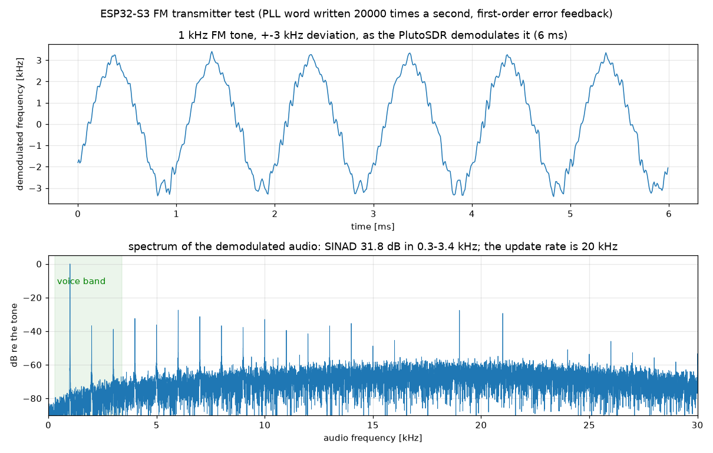
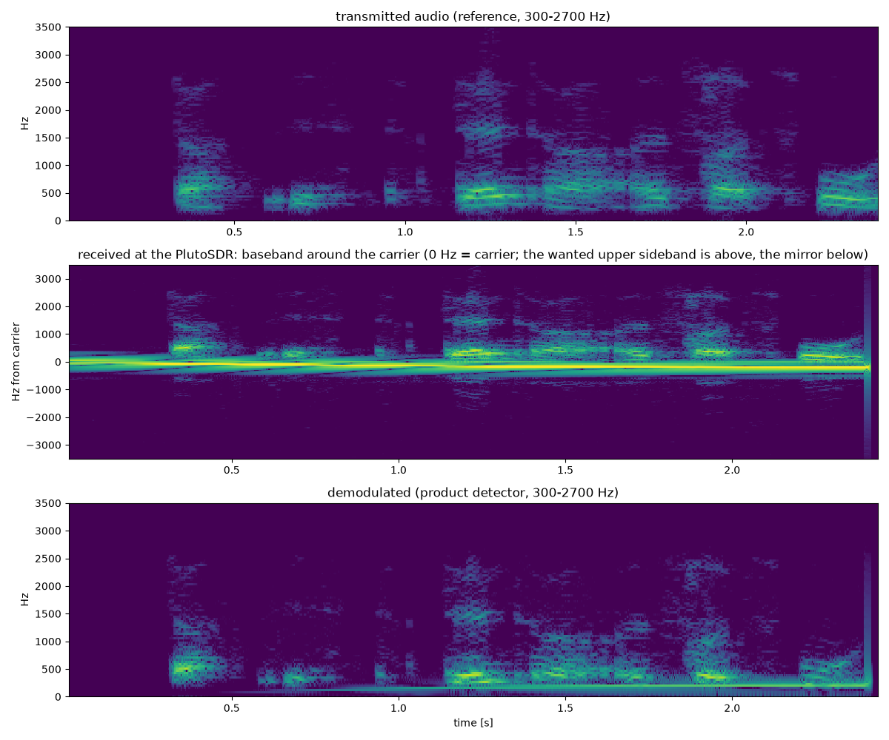

# Can the ESP32-S3 transmit? Research notes

**Status: experimental research, not part of the supported firmware.** The narrowband receiver and its releases never transmit. The
research build is made with `make -C esp32s3 NARROWBAND=1 TXTEST=1` and is loaded into RAM only (`espdr_load.py`, no flash); a reset
returns the board to whatever is in its flash. Transmitting needs a licence: the firmware refuses anything outside 2320..2400 MHz
(the 13 cm amateur band), limits every transmission in time, and the levels measured here are microwatts at the antenna of a plain dev board, but
that does not change who is responsible. Everything below was measured with a PlutoSDR as the receiver at 50 cm; one board, one host.

## In short

No I/Q transmit input of the ESP32-S3 was found (the test-tone registers are not one, and a possible SRAM-fed path on other ESP32 chips is unexplored, see Stage 4), but its PHY library's test-tone mode gives a carrier that can be moved in **frequency** through the
RF PLL's sigma-delta word (459 Hz steps, 40 kHz updates) and in **amplitude** through a gain code (0.28 dB per step, 18 dB range, 20 kHz fast).
Together that is polar modulation, and it carries:

| Mode | Result |
|---|---|
| unmodulated carrier | clean, 2350.0125 MHz for 2350.000 requested (the crystal), thermal drift of -194 Hz in the first 5 s, afterwards 2 to 3 Hz/s |
| FSK | +5 kHz at up to 5 kHz toggling, no dropouts (write only the low byte of the word) |
| narrowband FM | 1 kHz tone, +-3 kHz: SINAD 31.8 dB; speech, +-2.5 kHz: understood, 19 dB SINAD in the voice band (limited by the receiver's noise) |
| **SSB (USB)** | two-tone: unwanted sideband 61 to 63 dB and third-order intermodulation 33 dB below the wanted tones with the carrier fully suppressed (29 / 51 dB with a 55 % carrier); speech: understood, 19 s transmissions with the drift cancelled |


*SDR++ with a HackRF on a second computer, USB demodulator (2.8 kHz), tuned to the carrier at 2350.0125 MHz while the ESP32-S3 transmits looped
speech (carrier ratio 0.05). The spectrum shows the narrow carrier line, the waterfall the syllables of the voice as bursts in the upper sideband, next to
the carrier and none below it. The thin vertical line at the left is constant over the whole recording and not part of the transmission
(presumably a spur of the receiver; not investigated).*

## How to use it

```sh
make -C esp32s3 NARROWBAND=1 TXTEST=1 BUILD=build-tx           # needs the same toolchain as the receiver build
python host/python/espdr_load.py esp32s3/build-tx/iq-source.bin # into RAM; a reset brings the old firmware back
pip install -r host/python/requirements-tx.txt
python host/python/espdr_txtest.py --selftest                   # signal preparation, no hardware
# every command below needs --go, otherwise it only prints what it would do
python host/python/espdr_txtest.py --freq-khz 2350000 --g 127 --ms 500 --go                       # carrier
python host/python/espdr_txtest.py --freq-khz 2350000 --audio speech.wav --fm-dev 2500 --go       # FM voice, <= 4.9 s
python host/python/espdr_txtest.py --freq-khz 2350000 --ssb speech.wav --ms 2400 --carrier 0.05 --loops 8 --go   # SSB voice, 19 s
python host/python/espdr_txtest.py --freq-khz 2350000 --ssb twotone:700,1700 --ms 300 --carrier 0.0 --go          # SSB test signal
```

The SSB voice is **upper sideband**: tune a USB receiver to the carrier frequency (2350.000 MHz plus the crystal error of the board; on the
tested board +12.8 kHz). With `--carrier 0.05` a faint pilot helps to tune. `--ssb-delay 1.0` (25 us) and `--drift-hz 210` are
values measured on one board and one ambient temperature. The audio buffer holds 192 KB, which is 2.4 s of SSB or 4.9 s of FM voice;
`--loops` repeats the SSB clip (up to 30 s in all). How the signal is prepared on the host is described in the section on polar modulation below
and in `prepare_ssb()`. The experiments of the sections before it (`--nco-hz`, `--ladder`, `--gain-ladder`, ...) are kept so that the
measurements can be repeated.

Known limits: one board; the gain code and the delay are calibrated by hand; no compressor, no streaming (a clip must fit into the buffer); no
receive while transmitting; the transmitter's amplitude drifts by about 3 dB in 20 s (it scales the carrier and the speech together).
Open: streaming, computing the Hilbert transform and the polar conversion on the ESP, and a TX mode in the normal firmware (see the end of this file).

## Stage 0: what the vendor PHY library does for a TX tone (disassembly only, nothing measured)

Source: `libphy.a` and `librftest.a` of ESP-IDF 5.5 (`components/esp_phy/lib/esp32s3`), read with `objdump -dr`. Everything below is
read from instruction sequences and is **inferred**; field names are guesses until a measurement confirms them.

* `start_tx_tone_step(a, i, g, b, q, h)` (`phy_reg.o`) writes the frontend registers `0x60006040` (I side) and `0x60006044` (Q side):
  bits 9:0 a signed value (`i` or `q` shifted right by 2; the two low bits go to `0x60006050` bits 1:0 and 3:2 when bit 29 of
  `0x60006040` is set), bits 17:10 the negated byte `g` (or `h` for Q), bits 25:18 the byte `a` (or `b` for Q). If `a | b` is not
  zero, bit 26 of `0x60006000` is cleared and bit 10 of `0x600061e4` is set; otherwise the opposite. That pair of bits looks like
  the switch between normal baseband TX data and these constants. The registers hold constants, so I and Q are
  DC levels: the transmitter is a carrier at the LO, offset in phase and amplitude by (I, Q).
* `start_tx_tone` is a wrapper that scales `i` and `q` by 32/5 (10-bit mode) or 128/5 (12-bit mode) first.
* `phy_txtone_start(freq_mhz16, offset_s16, gain8)` (`phy_feature.o`): `set_rf_freq_offset` (→ `set_rfpll_freq(chan, freq, offset)`),
  `target_power_backoff(min(gain - 12, 127))`, sets bit 1 of `0x60006000`, writes a power field into bits 17:10 of it, calls two
  `g_phyFuns` hooks, then `start_tx_tone_step(1, 0, <gain byte>, 0, 0, 0)`: I = constant 1, Q = 0. So a "tone" is the LO with a
  constant baseband level of 1.
* `phy_set_freq(freq_mhz16, offset_s16)` also ends in `set_rfpll_freq`. This firmware already owns the PLL (`tune_pll()` in
  `esp32s3/src/radio.c`), so the transmit frequency would come from the same synthesizer plan as in receive.
* `force_iq_set` (`librftest.a`) writes `0x6000607C`, the receive I/Q correction register (see `board.h`). It is not the transmit path.
* `stop_tx_tone` clears bits in `0x60006040/44/4c` and sets bit 26 of `0x60006000` again.

What this suggests, to be tested: if the hardware samples these registers continuously, writing `0x60006040/44` from the CPU gives an
I/Q source of CPU speed, limited by the 8/10-bit fields and by the filters after them. A DC value gives a carrier; a sequence gives
modulation. Whether it works, at what rate and how clean, is unknown.

## Stage 2: an unmodulated carrier from our own firmware (measured)

Build: `make -C esp32s3 NARROWBAND=1 TXTEST=1 BUILD=build-tx` (research only, never part of a release). `radio_tx_test()` in `radio.c`
follows the PHY's own continuous-wave test (`wifiscwout`): `tune_pll()` to the wanted LO, `txcal_debuge_mode()`, `tune_pll()` again,
`start_tx_tone_step(1, 0, g, 0, 0, 0)`, wait, `start_tx_tone_step(0, ...)`, `txcal_work_mode()`, then the receiver is configured again. No
WLAN channel is involved: the carrier sits where the project's LO plan puts it. Limits in the firmware: 2320..2400 MHz, g >= 64, 5 s.
Receiver: PlutoSDR at 50 cm, centre 2349.5 MHz, 3 Msps, `host/python/espdr_txtest.py --freq-khz 2350000 --g 127 --ms 500 --go`.

| Result | |
|---|---|
| Carrier frequency | **2350.0125 MHz** for 2350.000 requested (+5.3 ppm, in line with this board's crystal), stable to the 0.1 kHz resolution of 10 ms windows |
| Burst | exactly 0.5 s, off immediately afterwards; the receiver returns to normal |
| Spurs | no line above 17 dB over the noise in the 3 MHz recorded |
| `g` | smaller means stronger: 127 → 124 → 120 gave +1.2 dB and +0.7 dB, about 0.27 dB per step (the PHY's 0.25 dB unit) |
| Level | PlutoSDR (not calibrated) at gain 0 dB: -60 dBFS at 50 cm; the AD9361's full scale is roughly -10 dBm there, so about -70 dBm received and about -35 dBm radiated, +-10 dB. At gain 60 dB the same carrier overloads the Pluto. |

Conclusion: the transmit chain works with our bring-up, on a frequency of our choosing.

## Stage 3: moving the carrier by writing the frontend registers (measured, negative so far)

Idea: `start_tx_tone_step(a, i, g, b, q, h)` writes `0x60006040` (I side) and `0x60006044` (Q side); if the fields were a baseband I/Q input,
calling it in a loop would modulate the carrier. Same setup as stage 2, `g = 127`, PlutoSDR at 0 dB gain.

| Test | What | Result |
|---|---|---|
| 3a | `(1, A cos, g, 0, A sin, 0)` as a rotating vector at +20 kHz, 100 kHz update rate, A = 400, 300 ms, no update late | carrier 35 dB **lower** than the plain carrier; weak lines at multiples of 20 kHz around it (+9 and +6 dB over the noise at -20/+20 kHz) |
| 3b/3c | the same with a 10 Hz rotation, A = 400 and 900 | essentially no signal (rms 0.00051 against a noise of 0.00044) |
| 4 | 10 static states, 60 ms each: `(a,i,b,q)` = (1,0,0,0) 0.771e-3; (0,0,0,0) 0.049; (0,100,0,0) 0.025; (0,-100,0,0) 0.003; (0,0,0,100) 0.013; (0,0,0,-100) 0.017; (1,100,0,0) 0.008; (1,-100,0,0) 0.003; (2,0,0,0) 0.009; (0,300,0,0) 0.010 (carrier magnitude, full scale 1) | **only the first state transmits**, 65 ms of activity in the recording; every later state, including (1,100,0,0) which differs from the first only in `i`, and (2,0,0,0), gives at least 25 dB less |

Reading: the registers are not a plain I/Q input, and a second call does not simply change the carrier. Either the fields mean something
else (a tone generator with `i` and `q` as frequency or phase terms, a power-up or gain sequence that only the first call performs), or the
first call arms something the later ones switch off. The next tests separate these.

### Stage 3, tests 5 and 6

Test 5 (ladders of three states, 50 ms each, `g = 127`, energy per 5 ms instead of the coherent mean, which phase jumps between states had
made misleading): `(1,0,0,0)` then `(2,0,0,0)` then `(1,0,0,0)` gives a carrier at 0.98e-3 rms, then **20 dB less** at the same
frequency, then 0.98e-3 again. `a` is not a linear amplitude, and `i` and `q` are not an I/Q input (`(1,100,0,0)` also kills the
carrier). The fields look like parameters of a test-tone generator. Conclusion: this register pair gives key-on/key-off at best.

**Test 6: FSK through the PLL's sigma-delta word works.** After `tune_pll()` has found the lock window and pinned the capacitor, the
carrier is started as in stage 2 (`start_tx_tone_step(1, 0, g, 0, 0, 0)`) and only the word is rewritten (`I2C_SDM` registers 3..5,
bracketed by writing 0x07 and 0x17 to register 0, as `tune_pll()` does): `radio_tx_fsk()`. The word is `W` in `LO = 30 MHz x (32 + W/65536)`, a
step of 457.8 Hz. PlutoSDR at 20 dB gain (carrier at -42 dBFS rms, peak 0.012), 400 ms, toggling between 2350.000 MHz (+12.5 kHz
crystal offset) and +5 kHz at 50 Hz:

| | |
|---|---|
| Frequency | 0 / +5000 Hz (measured 4900..5180 Hz in single 2.5 ms readings), 40 word updates, all as commanded |
| Amplitude | 8.0e-3 rms, constant to +-2 %, no dropout at any jump |
| Settling | below 2.5 ms (the measurement grid) |

Next: higher toggle rates and a sinusoidal word sequence (FM) to find the modulation bandwidth the loop allows.

### Stage 3, tests 7 and 8: how fast can the word be rewritten

All with +5 kHz deviation, `g = 127`, PlutoSDR at 20 dB gain; 200 ms bursts.

| Test | Update | Toggle rate | Updates written | Result |
|---|---|---|---|---|
| 7a | 5 register writes with the bracket | 500 Hz | 200 of 200 | full swing (-114 / +5131 Hz), amplitude dips to about 10 % at every jump |
| 7b | the same | 2000 Hz | 800 of 800 | full swing (-423 / +5317 Hz), dips |
| 7c | the same | 5000 Hz | 2000 of 2000 | amplitude halves (3.95e-3 against 9e-3), frequency estimate breaks up: the loop is disturbed |
| 8a | low byte of the word only, no bracket | 2000 Hz | 800 | 776 clean edges in 194 ms = 2000 Hz, swing -110 / +5226 Hz, **no dip** (0.0 % of the time below 30 % of the mean) |
| 8b | the same | 5000 Hz | 2000 | 1940 edges in 194 ms = 5000 Hz, swing -185 / +5259 Hz, **no dip** |

The dips come from bracketing every update with `0x07` / `0x17` in register 0 (see the left half of `images/tx-fsk-spectrum.png`). Writing
only the low byte works as long as the two words share their upper bytes, i.e. a swing of less than 117 kHz that does not cross a
256-step boundary. The achievable modulation rate is therefore at least 10 kHz updates (2 per toggle at 5 kHz), enough for voice.
Caveat: the amplitude seen at the Pluto differs between runs (4.4e-3 to 9e-3) because the same recording filter keeps both tones in its band; the carrier itself is
constant within a run.


### Stage 3, test 9: audio FM (measured)

`radio_tx_fm()`: the low byte of the PLL word follows `dev * sin(2 pi f t)` with first-order error feedback (the word steps are 457.8 Hz),
updated 20 000 times a second; 1 kHz tone, +-3 kHz commanded deviation, 500 ms, `g = 127`. Demodulated from the PlutoSDR recording
(20 dB gain, 25 kHz filter, 100 ksps phase derivative):

| | |
|---|---|
| Deviation | 2905 Hz peak (commanded 3000) |
| Carrier | 8.5e-3 rms, 5th..95th percentile 7.9..9.1e-3 (+-0.6 dB), no dropout in 46 000 samples |
| Voice band 0.3-3.4 kHz | tone against noise and distortion: **SINAD 31.8 dB** |
| Harmonics 2..5 | -37, -39, -32, -36 dB |
| Noise 5..25 kHz | -18 dB re the tone (shaped by the error feedback; a narrow receiver filter removes most of it) |

Conclusion so far: **narrowband FM with an ESP32-S3 as the only RF hardware works**: 31.8 dB SINAD is telephone-quality voice. The limits
come from the word's step size (458 Hz) and the first-order shaping; a finer step or a second-order feedback would help.



## SSB stage A1: the gain field as an amplitude control (measured, the premise did not hold)

Plan: amplitude through bits 17:10 of `0x60006040` (`(-g) & 0xFF`), written directly, so that SSB can be built as polar modulation
(amplitude by the gain field, phase by the PLL word). `radio_tx_gain()` starts the carrier as in stage 2 with g = 127, waits 20 ms, then
writes the field alone: a ladder g = 127, 135, ..., 255 (field 129, 121, ..., 1), 25 ms per step, PlutoSDR 20 dB at 50 cm.

| g (field) | amplitude [e-3] | against g = 127 |
|---|---|---|
| 127 (129) | 2.56 | 0 dB |
| 135 (121) | 24.9 | **+19.8 dB** |
| 143 (113) | 25.8 | +20.1 |
| 175 (81) | 24.7 | +19.7 |
| 207 (49) | 22.9 | +19.0 |
| 255 (1) | 22.0 | +18.7 |

* Writing a smaller field value **raised** the carrier by 20 dB, then it stays on a plateau that falls by only 1.4 dB across 112 codes
  (about 0.012 dB per code), against 0.27 dB per code between g = 120 and 127 (stage 2). Seen as a signed byte, the field is negative
  (-127..-120) in the weak state and positive (+1..+121) on the plateau: bit 7 of the field looks like a ~20 dB switch, the low bits
  a weak fine control. Not established.
* The carrier at the nominal g = 127 was 2.5e-3 in this run; earlier runs gave 2.3e-3 to 9.3e-3 at the same Pluto setting. The level at a
  given g varies by about 10 dB from run to run. The PHY's own CW test compensates with a runtime value (`g = max(attenuation - REG(0x60006004) + 40, 0)`),
  which our bring-up does not set up.
* The plateau (25e-3 at the Pluto's 20 dB, i.e. about 9 dB above the earlier tests) is the strongest carrier seen so far, still in the
  microwatt range (about -26 dBm radiated, +-10 dB). The assumption "g >= 127 is never stronger than before" was wrong.

Conclusion for SSB: the gain field is a coarse 20 dB step plus a weak slope, not a smooth amplitude control; the run-to-run level
differences make it worse. Open: other amplitude controls (field `a` in bits 25:18: 0 / 1 / 2 gave off / on / -20 dB; the PHY's power
backoff `target_power_backoff`, the `0x60006000` power field in bits 17:10, the digital TX gain `rom_set_tx_dig_gain`).

## SSB, stage A continued (measured)

* **Registers with the carrier on** (g = 127): `0x60006040 = 0x20060400` (bit 29 set, `a` = 1 in bits 25:18, gain field 129 in bits 17:10),
  `0x60006004 = 0` (the value the PHY's own CW test subtracts from its power setting), a table of 28 signed bytes (-29 ... -3) at
  `0x60006014..0x60006030`.
* **`target_power_backoff(b)` (PHY), b = 0..120:** no effect at all on the test tone (all steps within 0.1 dB). A call takes 38 us.
* **Field `a`:** a switch, not an amplitude: odd values transmit (`a` = 1: 2.22e-3, `a` = 3: 2.34e-3), even values are off (-34 dB).
* **Gain code g, two branches.** `g >= 128` (field <= 128): plateau, flat to 1.4 dB up to g = 255. **`g <= 127` (field >= 129): a smooth, monotone
  branch**, 4.0e-3 at g = 127 to 31.4e-3 at g = 64 (Pluto 20 dB): +17.9 dB over 63 codes, **0.28 dB per code**, no knee, and a frequency
  pull of only about -38 Hz across the whole range. At g = 64 the carrier is about 2 dB above the plateau. This branch is the amplitude control.
* **Speed (gain square wave between g = 127 and 70, 100 ms bursts):** swing 15.7, 15.8, 16.6, 17.5 dB at 1, 5, 10, 20 kHz as expected,
  10-90 % time about 3 us (limited by the 150 kHz measuring filter), toggle rate exact. One gain write is a read-modify-write of one register.

## SSB by polar modulation (measured): first clean single-sideband signal

`radio_tx_ssb()` plays `n` pairs (signed PLL-word delta, gain code g = 64..127) at 40 kHz: the amplitude of the analytic signal
`c + x_a(t)` goes through the gain code (via the measured curve), its instantaneous frequency through the PLL word (error feedback of the
second order, computed on the host). USB means the audio spectrum sits above the carrier. `prepare_ssb()` in `host/python/espdr_txtest.py`.
Carrier ratio 0.55 (the carrier is 55 % of the peak envelope), two tones 700 + 1700 Hz, 300 ms, PlutoSDR 20 dB at 50 cm:

| Line | Level against the carrier |
|---|---|
| carrier | 0 dB (-37.7 dBFS) |
| wanted +700 Hz / +1700 Hz | -7.8 / -7.8 dB |
| mirror (lower sideband) -700 / -1700 Hz | -34.9 / -30.0 dB (27.1 / 22.2 dB below the wanted tones) |
| IMD3 at -300 Hz / +2700 Hz | -64.4 / -54.1 dB |
| noise floor 8..30 kHz above the carrier | -70.7 dB |

The mirror grows with the audio frequency: the gain path and the frequency path do not have the same delay. Shifting the gain path
against the frequency path (positive = later), mirror suppression against the weaker wanted tone:

| delay [updates of 25 us] | -2 | -1 | 0 | +0.6 | +0.8 | **+1.0** | +1.2 | +1.4 | +2 |
|---|---|---|---|---|---|---|---|---|---|
| suppression [dB] | 21.4 | 24.4 | 22.2 | 28.6 | 29.8 | **30.3** | 29.7 | 28.9 | 28.4 |

The gain path has to be delayed by about 25 us. About 30 dB suppression remains, probably limited by the gain code's 0.28 dB steps and the
word's 459 Hz steps; enough for voice. Default of `--ssb-delay` is 1.0.

## A bug in the audio upload that spoiled the earlier speech test (found and fixed)

The audio buffer sits in the unused capture banks, which accept **32-bit accesses only**: a byte store fills all four byte lanes. Op 71
therefore kept only the last byte of every four (read back: 4, 4, 4, 4, 8, 8, 8, 8, ...). The earlier FM speech test played every fourth sample,
four times each (a 5 kHz effective sample rate), which explains the roll-off above 2 kHz and much of the low SINAD that had been blamed on the PLL. The
first SSB attempt showed it as a carrier shifted by 31 to 58 kHz (the word delta was the gain code). Fixed: the upload assembles words,
the playback loops read words (`tx_byte()`), and a readback op (79) verifies it. The FM speech result (SINAD 15.7 dB, flat to 1.6 kHz) is therefore
**not** a limit of the transmitter and must be repeated.

## SSB with speech (measured)

a 5.3 s speech recording (the first 2.4 s: mono, 8 kHz, 300..2700 Hz, normalised), USB with a carrier at 0.55 of the peak, 40 kHz updates, delay 1.0,
PlutoSDR 20 dB at 50 cm; 96 000 updates, none late. Spectrograms of the reference, of the received baseband and of the product-detector
audio are in `images/tx-ssb-speech.png`: pitch harmonics, formants and pauses arrive intact, the mirror sideband is visibly weaker
(unwanted sideband 23.5 dB below the wanted one in the 300..2700 Hz speech band; carrier 5 dB over the speech power).



**The carrier drifts down by about 250 Hz during the 2.4 s** (the yellow line in the middle panel). A fixed-frequency product detector
therefore scrambles the waveform (correlation with the reference only 0.07, SINAD meaningless), whereas a receiver that follows the carrier
(SDR++ with its carrier tracking, or retuning by hand) hears the speech. Likely causes, not yet separated: warm-up of the transmitter's power
stage pulling the PLL, or drift in the PLL's own VCO with temperature after the transmitter is switched on. To measure with an unmodulated
carrier of 3 s and, if it is repeatable, to cancel it with a slow ramp of the PLL word in the host preparation.

## Thermal drift of the transmitter and a 19 s SSB speech transmission (measured)

**Drift of an unmodulated carrier** (g = 90, 28 s, PlutoSDR; the first attempt stopped after 10.1 s because `delay_us()` counts CPU cycles in 32
bits and wraps beyond 17.9 s; fixed by waiting in steps of one second). The carrier frequency falls, quickly at first and slowly afterwards, and the
carrier amplitude rises (a gain drift of the transmitter, about +3 dB):

| Interval after switch-on | Change of the carrier frequency |
|---|---|
| 0.3 s to 5 s | **-194 Hz** (about 120 Hz/s at the start) |
| 5 s to 10 s | -13 Hz |
| 10 s to 20 s | -35 Hz |
| 20 s to 27 s | -15 Hz |

Two time scales: about 0.9 s for the first 200 Hz, and a slow one (about 2 to 3 Hz per second) that is still running after 25 s. Repeatable
from run to run to about 20 Hz. Within the first 5 s the drift is almost over; after that it is irrelevant for speech.

**Compensation.** The firmware cancels the fast part itself (`radio_tx_ssb()`, parameter `drift_hz` = +210 Hz, decay of 1/32768 per update =
0.82 s at 40 kHz), by adding a second-order-free first-order-shaped correction to the word deltas, once, so that looped passes do not repeat it.

**19.2 s of SSB speech** (the same recording, the first 2.4 s played 8 times in a row, USB, carrier ratio 0.55, 40 kHz updates, delay 1.0,
drift 210 Hz): 96 000 x 8 updates, none late. The carrier stays within +-20 Hz of its mean (-198 ... -160 Hz against the reference), the level of
the speech sideband against the carrier is the same in every pass (-22.1 and -14.0 dB at the two measuring points), the amplitude of
carrier and speech together falls by 3.5 dB across the transmission (the gain drift above). Heard live on a second computer (HackRF, SDR++ with a USB
demodulator, see the screenshot at the top): **the speech is understood**.

Open: measure the SSB speech quality (SINAD) with a receiver that follows the carrier; repeat the FM speech with the fixed upload; reduce
the carrier ratio; continuous streaming instead of a looped 2.4 s buffer; compute the Hilbert transform and the polar conversion on the
ESP itself.

## Reducing the carrier (measured): true SSB with a suppressed carrier works

Two tones (700 + 1700 Hz, 300 ms), `prepare_ssb()` with the carrier ratio `c` (the carrier as a fraction of the peak envelope), the
envelope reaches down to the nulls of `c + x_a` which are far beyond the 17.9 dB the gain code covers; the code simply stays at 127 for
3 to 10 % of the updates (the word delta is limited to +-80 steps, the low byte of the word must not wrap). Everything else as before
(delay 1.0, drift cancelled in the firmware, PlutoSDR at 20 dB):

| carrier ratio | wanted tone against the carrier | unwanted sideband below the wanted tone | IMD3 below the wanted tone |
|---|---|---|---|
| 0.55 | +8.0 dB | 29.4 dB | 51 to 54 dB |
| 0.45 | +3.9 dB | 33.8 dB | 41 to 42 dB |
| 0.35 | +0.4 dB | 42.0 dB | 40 to 45 dB |
| 0.25 | +3.6 dB | 47.0 dB | 36 dB |
| 0.15 | +8.7 dB | 54 to 55 dB | 35 dB |
| 0.10 | +12.1 dB | 55 to 62 dB | 33 to 34 dB |
| 0.05 | +19.3 dB | 58 to 61 dB | 33 to 35 dB |
| **0.00** | +41.4 dB (carrier leakage) | **61 to 63 dB** | 33 to 34 dB |

So the carrier can go away completely: a carrier leakage 41 dB below each tone, the unwanted sideband beyond 60 dB, third-order
intermodulation 33 to 35 dB below the tones, which is the quality of a plain amateur SSB transceiver. The IMD3 grows from -52 dB to -34 dB as the
carrier shrinks (the envelope passes through zero) and then stays there; the unwanted sideband improves.

**Speech with 5 % carrier** (`--carrier 0.05`, 19.2 s looped): averaged over 7 s the energy sits 300 to 3000 Hz above the carrier, with the voice
fundamental at 513.0 to 513.2 kHz at -70 dB; the mirror region (0.3 to 0.7 kHz below the carrier) is at -97 dB, at least 27 dB lower and
limited by the noise floor of the measurement (the two-tone result above is the better figure).


## Repeated FM speech with the upload fixed, and a second upload bug (measured)

After the 32-bit fix the FM speech (the same recording, +-2.5 kHz, 40 kHz updates, second-order error feedback in the firmware) gives a
demodulated deviation of 2125 Hz against 2087 Hz in the input and a voice-band SINAD of **19.0 dB** (15.7 dB before), with the carrier-to-noise ratio of
the Pluto at about 30 dB; the voice-band noise of an FM discriminator at that ratio explains most of the remaining difference to the 37 dB the quantisation
alone would allow. Played: 196 608 of 211 758 updates. The cause is a second upload bug: the firmware refuses a chunk whose length is not a
multiple of four, and the host did not look at the reply, so the last 7575 samples were dropped and their bytes were left on the line. `upload()` now pads to
whole words, checks every reply and refuses data that does not fit the buffer.

## Transmit in the normal firmware, or a separate image?

Measured with `size` on the two images (the receiver `NARROWBAND=1`, the research build `NARROWBAND=1 TXTEST=1`):

| Region | Size | Receiver | With transmit | Left |
|---|---|---|---|---|
| core 0 code (`.text`) | 61 440 B (up to the transmit kernel at `0x4038F000`) | 54 198 B | 60 938 B | **502 B** |
| core 1 code (`.core1_text`) | 28 672 B | 7 806 B | 7 806 B | 20 KB |
| `.data` (tables, read-only data) | 8 192 B | 6 543 B | 7 263 B | 929 B |
| `.bss` + stacks | 57 344 B | 57 120 B | 57 296 B | **48 B** |

A combined image would fit only by moving things: the transmit functions can live in the core-1 bank (they run while no capture is running, so
the cores do not compete for instruction fetches) and the work RAM needs a smaller core-1 stack. Half-duplex operation is no problem
(`radio_tx_*()` already releases the receiver and sets it up again afterwards), full duplex is not possible (one PLL).

**Recommendation: two images from one source tree** (what `TXTEST=1` does), not one combined image:
* The receiver image stays free of any transmit code. That is verifiable (the CI builds it unchanged), it is what people who have no licence
  or no wish to transmit download, and it keeps the memory budget of the decimator, which has 40 % of the CPU time to spare but almost no RAM.
* Switching costs a few seconds and no flash write: the host loads the transmit image into RAM (`espdr_load.py`, the same step as for the
  receiver), transmits, and a reset brings back the receiver from flash. A wrapper that does both steps (`espdr_txtest.py --load`) is a small
  addition; what it needs is both USB cables, as for any load.
* A combined image remains possible later as a build option (`TX=1` for the receiver plus the transmit ops in the core-1 bank) if there is a
  reason that outweighs the points above, for example a transmit and receive program that keeps one USB connection open.


## Stage 4: searching for an SRAM I/Q transmit path (static analysis)

Prompted by a comment that other ESP32-family chips have arbitrary I/Q TX with samples read from SRAM. Source: `espressif/esp-phy-lib`
(`libphy.a`, `librftest.a`, `libbttestmode.a` for esp32, esp32s2, esp32s3, esp32c5, esp32c6), disassembled with the ESP toolchain's objdump (Xtensa) and
binutils (RISC-V). Static only, nothing measured on hardware. **Result: no SRAM I/Q transmit path in the libraries; not ruled out in the hardware.**

* **esp32c5 / esp32c6:** `fedump_wr_txmem`, `fedump_rd_txmem` and `fedump_rd_rxmem` exist ("front-end dump", TX memory writable), but all three are empty
  stubs (`ret`). That suggests the hardware has the feature on these chips and the library does not use it.
* **esp32c6 `loop_dump_test`:** sends a normal Wi-Fi packet (`WifiTxStart_org`), triggers `adctrig` and reads the RX dump. A loopback with a real packet, not
  free I/Q. `set_dump_mode` writes `0x600A0958` and `0x600A70B8`.
* **esp32 / esp32s2:** `clear_txdumpmem`, `get_txdumpaddr` are a capture of the transmit signal into RAM, an output not an input.
* **esp32s3:** no `fedump_*`. `phy_chan_dump_cfg` writes `0x6001CD0C` (RX channel dump configuration, probably what eSpDR uses). `set_pbus_mem`,
  `tx_pbus_set` program the analog bus, not samples. Bit 26 of `0x60006000` and bit 10 of `0x600061E4` are only touched by `start_tx_tone_step` and `stop_tx_tone`.

An SRAM-fed path, if it exists, would have to be driven by direct register access (as the receive dump is), so no library would show it.

Next steps (need hardware): compare the S3 register space around `0x6001Cxxx` and `0x6000Axxx` with the C6 `set_dump_mode` registers; dump registers before and
after a normal `WifiTxStart` and diff them; ask the commenter which chip and registers they use.

## Stage 5: `dactrig`, a DAC playback engine fed from SRAM (static analysis, hardware test pending)

Result of the first pass of the disassembly plan. The register map from the PHY libraries is in [REGISTER-MAP.md](REGISTER-MAP.md). Static only,
**nothing here is measured yet**; every bit meaning below is inferred from instruction sequences.

`libphy.a`/`librftest.a` of the S3 contain `mac_common:adctrig` and **`mac_common:dactrig`**. `adctrig` is the ADC dump engine that eSpDR already uses
(`0x60033D5C` run/length, `0x60033D60` write index, `0x600C101C` bank select). `dactrig` is its counterpart for the **DAC**, driven through a new register, **`0x60033D64`**.
The symbol exists on S2, S3, C3, C6, C5, C2 and H2 (ESP32 has only `adctrig`), which fits the claim that other ESP32-family chips have arbitrary I/Q TX from SRAM.

What `dactrig(a2, a3, a4, a5)` does on the S3, in order:

1. `0x60033D64 &= 0x7FFFFFFF` (bit 31 cleared: stop/idle).
2. Fills `0x10000` words at **`0x3FCD0000`** (internal SRAM, the same area `adctrig` uses for its dump bank) with a ramp, `(i >> 3) + 0x100`.
   (The loop stores a 32-bit word at base + i with i counting in bytes; if that is really what the library does, it is test code that was never run on the S3,
   because an unaligned `s32i` traps on Xtensa. The C6 build contains the same loop. Do not read the exact stride as format information.)
3. Programs `0x60033D64`:
   * bits 13:0 = `a2` (length/ring size in samples or words),
   * bit 15 = `0` if `a3 == 1`, else `1` (mode select),
   * bit 19 = `1` if `a4 != 0` (option, perhaps repeat/loop),
   * bits 27:20 = low 8 bits of `a2` (second field, meaning unknown),
   * bit 31 = `1` (start).
4. Polls `0x60033D64` until **bit 18** is set (done or wrapped).
5. `ets_delay_us(10000)`, then writes `0` to `0x60033D5C` (stops the ADC dump that the loopback test ran alongside), and prints the arguments with `phy_printf`.

Reading: a DMA-like engine reads sample words from SRAM and feeds the DAC (TX baseband), in the style of the RX dump engine, started by one bit. That is the "samples read
right from SRAM" the commenter described. What is **not** known: the SRAM base address register (the library only fills `0x3FCD0000`, so it may be a fixed base or set elsewhere,
for example by `0x600C101C` or `0x60033D84`, which `tx_a_frame` touches), the sample format (I and Q packing, bit width), the sample rate (probably the DAC clock, 80 or 160 MHz,
with a divider in bits 27:20), and what routes the DAC output to the RF transmit chain (the library calls `dactrig` only from a test console, there is no caller in the library, so the
transmit chain has to be put in a mode like `txcal_debuge_mode`/`start_tx_tone_step(1,0,g,0,0,0)` first, as in Stage 2).

On C6, `dactrig` is reduced to the ramp fill (`0x40840000`) and the print: the register programming is gone from that build, so the S3 version is the better reference.

### Next: hardware tests (in order)

1. Reproduce Stage 2 (carrier from `radio_tx_test`) and then, with the carrier running, call the `dactrig` sequence from our firmware with a constant buffer at `0x3FCD0000`
   (first all words `0`, then a constant, then the ramp from the library). Measure with the PlutoSDR whether the carrier changes (level, phase, offset).
2. Replace the ramp with a sine at a known frequency (words as I/Q pairs, then as one real value) and look for a line that moves in the spectrum when the pattern frequency changes.
   Try both word formats and both values of bit 15.
3. Dump `0x60033D5C..0x60033D90` before and after `dactrig` to find the registers it leaves changed (base, rate), and diff against an idle snapshot.
4. If the DAC output only goes to the loopback path (calibration), look for the TX mux: bit 26 of `0x60006000`, bit 10 of `0x600061E4`, `txcal_debuge_mode()`, `force_txon_mode`.
